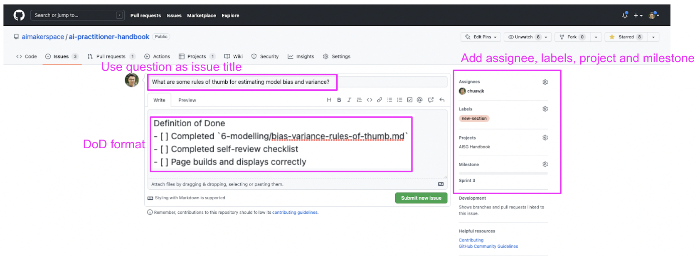
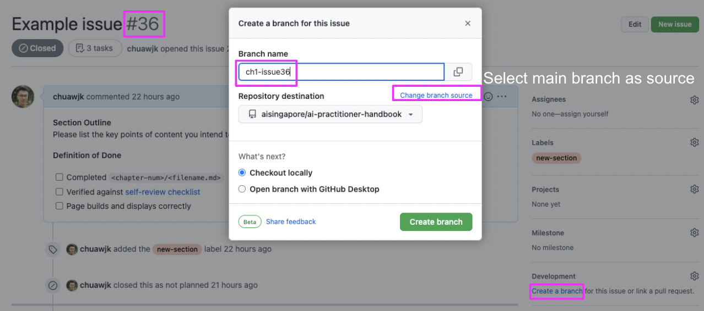
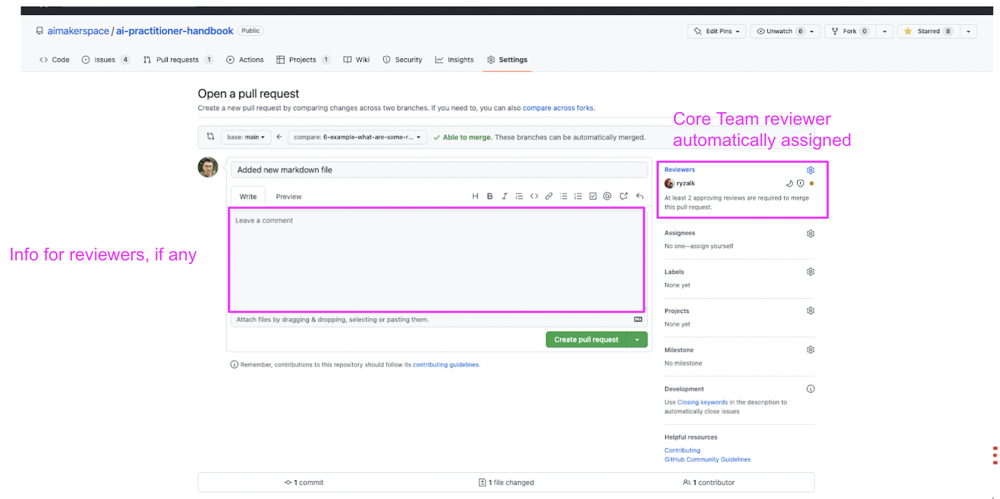

# Contributing to AI Singapore's AI Practitioner Handbook

Contributors: Ryzal Kamis and Kenny WJ Chua

---

This miscellaneous chapter covers two main aspects of contributing to the handbook--
workflow conventions for writing a new sections, and conventions for the content in
each chapter.

## Workflow conventions for a new section
This section covers the steps required to write a new section of the handbook. 
In summary, the 5 steps are as follows:
1. Create new issue
2. Fill in issue details
3. Add issue to board (i.e., GitHub Projects); move to review section when completed
4. Open new feature branch with name `chX-issueNum`
5. Submit pull request to develop branch

### 1. Create a new issue


### 2. Fill in issue details


### 3. Add issue to board (i.e., GitHub Projects); move to review section when completed


### 4. Open new feature branch with name `chX-issueNum`
E.g., branch `ch1-issue5` denotes the feature branch for issue 5, which is a section within chapter 1

### 5. Submit pull request to develop branch
Before submitting the pull request, please ensure that all items in the definition
of done are completed. Please build the site locally, and visually verify that
your contributions are displayed as intended. You may build the site from the base
directory of the repository using the the CLI command:
```bash
jupyter-book build .
```


For AISG contributors, please submit your pull requests at least three working days
before sprint review.

After [reviewing](./REVIEWING.md) your issue, reviewers will provide suggestions
for edits, if any.


## Content Conventions

This section covers the conventions that were adhered to
in writing this book and how they affect the appearance as well as
standardisation efforts. Aside from ensuring that this book remains
readable and accessible, such conventions would make the process of
maintaining and reviewing contributions manageable. The conventions are
covered across 4 different sections:

- Structure
- Content
- Language
- Formatting

To expedite the process for checking if your contributions adhere to the
conventions, you may refer to the table below:

__Summary Checklist:__

- No subdirectories are to be created within chapter directories.
- Only Markdown files are to be used for generating content.
- If a Jupyter Notebook is used, use Jupytext pairing function to
  export to MyST flavoured Markdown file. Commit and version both files.
- Ensure headers are in sequential order.
- No manual table of contents.
- Citations and bibliographioes are populated in the centralised
  BibTeX file `book/references.bib` and referred to correctly.
- For language, use Singaporean Standard English.

SECTION | CHECK
------- | -----
Structure | Check that your content is in the appropriate location/directory.
Content | Focus on long-standing content like principles, strategies, design patterns, or digestible concepts.
Content | Minimise references to tools.
Content | Limit to 500 words.
Language | Write in the form of a continuous prose.
Language | Use singular first-person pronouns and address readers as second person.
Language | Omit contractions.
Language | Avoid AISG terminology.
Formatting | Insert snippet for contributors at the top of your content.
Formatting | Adhere to PEP 8 for Markdown files (line lengths), code and Jupyter Notebooks.
Formatting | Use MyST flavour for Markdown documents. For notebooks, pair using Jupytext.
Formatting | Use sequential headings.
Formatting | Do not create TOCs manually.
Formatting | Present tables or figures inline after first mention.
Formatting | Credit references at the end of your content. Do not use in-text citations or bibliographies.

### Structure

You may refer to this section for the appropriate directories which
files and assets are to be placed under.

#### Repository Tree

The tree of the repository containing the book is structured as such:

```
ai-practitioner-handbook
    │
    ├── _config.yml     <-  YAML file detailing configurations for
    │                       Jupyter Book.
    ├── _toc.yml        <-  Configuration file that determines the
    │                       structure of the book.
    ├── .gitignore      <-  File for specifying files or directories
    │                       to be ignored by Git.
    ├── CHANGELOG.md    <-  Text file that lists changes made to the
    │                       project in chronological order.
    ├── CONTRIBUTING.md <-  File specifying conventions and formats
    │                       for contributors' reference.
    ├── README.md       <-  The top-level README containing basic
    │                       information of the project.
    ├── requirements.txt
    │                   ^-  File specifying dependencies needed to
    │                       generate the book.
    │
    ├── .github         <-  Folder (currently) housing workflow
    │                       definitions for GitHub Actions.
    └── book            <-  Directory containing book's contents and
        |                   assets.
        |── assets
        |               ^-  Directory containing non-text assets to be
        |                   referenced by the book.
        └── references.bib
                        ^-  Bibtext file containing citations and
                            bibliographies to be referenced by the book.
```

The files and directory that contributors will be mainly working
with are the following:

- `_toc.yml`
- `requirements.txt`
- `book/**`

Other files or directories are usually not to be modified unless
required and requested by the core reviewers of the book.

#### Book Directory & Contents

Most contributions will be populating the `book` directory and mainly
within directories pertaining to the different chapters.

Below describes each of the chapters and their respective
subdirectories:

#### 1. Pre-project Phase

__Directory Name:__ `book/1-pre-project-phase`

__Synopsis:__ *To be filled in...*

__Sections:__

- *Section 1*
- *Section 2*

#### 2. Project Management & Technical Leadership

__Directory Name:__ `book/2-proj-mgmt-tech-lead`

__Synopsis:__ *To be filled in...*

__Sections:__

- *Section 1*
- *Section 2*

#### 3. Collaborative Development Platforms

__Directory Name:__ `book/3-collab-dev-platforms`

__Synopsis:__ *To be filled in...*

__Sections:__

- *Section 1*
- *Section 2*

#### 4. Literature Review

__Directory Name:__ `book/4-lit-review`

__Synopsis:__ *To be filled in...*

__Sections:__

- *Section 1*
- *Section 2*

#### 5. Data Management, Exploration & Processing

__Directory Name:__ `book/5-data-mgmt-exp-proc`

__Synopsis:__ *To be filled in...*

__Sections:__

- *Section 1*
- *Section 2*

##### 6. Modelling

__Directory Name:__ `book/6-modelling`

__Synopsis:__ *To be filled in...*

__Sections:__

- *Section 1*
- *Section 2*

#### 7. Solution Delivery

__Directory Name:__ `book/7-solution-delivery`

__Synopsis:__ *To be filled in...*

__Sections:__

- *Section 1*
- *Section 2*

#### 8. Documentation & Handover

__Directory Name:__ `book/8-documentation-handover`

__Synopsis:__ *To be filled in...*

__Sections:__

- *Section 1*
- *Section 2*

Any new chapters or sections (within a chapter) to be added are to be
subjected to pull requests and further discussions and reviews.
Sections within chapters are all to be structured in a flat manner
and __subdirectories are not to be used__.

### Content

Here, we list down some pointers for you to keep in mind when
formulating your content:

- Do focus on content that can stand the test of time such as
  principles, strategies, design patters or digestible concepts.
- In this field of work, tools come and go and become obsolete quite
  quickly so minimise references to any.
- We aim to be concise but impactful so do __limit the number of words
  to 500__.

### Language

For consistency across all chapters, contributors are to stick to the
usage of a single language: Singaporean Standard English, which is
not much different from Standard British English.

Reviewers and contributors are to ensure correct grammar and consistent
tone for contributions:

- Your contents are to be presented in the form of a continuous prose.
- Do use singular first-person pronouns. For
  example: "__I__ suggest...".
- Do address readers as second person.
  Example: "__you__ may encounter..."
- Avoid contractions. Example: "let us" instead of "let's".
- Avoid AISG-specific terminology, e.g., "100E", "AI Apprentices". Use neutral 
alternatives such as "AI/ML project" and "junior developers", respectively, that
a general, external audience can better understand.

This is a collective effort and everyone has a
part to play in maintaining the quality of the book.

__Reference(s):__

- [Differences between British and American English](https://www.britishcouncilfoundation.id/en/english/articles/british-and-american-english)

### Formatting

This section details the format that contributors can refer to when
contributing content and files to the book.

#### Contributors' Credit

For the content pieces you have worked on, do remember to insert
the following snippet right after the header title with your name for
proper crediting.

```markdown
...
Contributor(s): <YOUR_NAME_HERE>, <ANOTHER_NAME_HERE>

---
...
```

#### PEP 8

All documents like Markdown, sample code, or Jupyter Notebooks are to be
subjected to the conventions laid out by PEP 8. Especially the maximum
line length; limit all lines to a maximum of 72 characters. For code,
the allowable maximum is 72 characters. However there are some
exceptions like when links or Markdown tables are concerned.

You can configure your IDE's or editor's settings to set vertical
rulers.

__Reference(s):__

- [PEP 8 - Maximum Line Length](https://peps.python.org/pep-0008/#maximum-line-length)
- [Visual Studio Code Docs - Settings](https://code.visualstudio.com/docs/getstarted/settings)

#### Markdown Flavour

This book treats Markdown files as first class citizens with regards
to contents. Meaning: all of the book's contents are to be strictly
derived from
[MyST flavoured Markdown](https://jupyterbook.org/en/stable/content/myst.html#myst-markdown-overview)
files. A contributor may formulate contents within Jupyter Notebooks
(`.ipynb` files) but they would need to do the following:

- Create the Jupyter Notebook under `notebooks`, under the appropriate
  subdirectory corresponding with the chapter it is meant for.
- Its contents are to be converted out to a Markdown file. This can be
  done with
  [Jupytext](https://jupytext.readthedocs.io/en/latest/index.html),
  through it's
  [paired notebooks functionality](https://jupytext.readthedocs.io/en/latest/paired-notebooks.html).
- In this case, both the paired `.md` and `.ipynb` files are to be
  committed.

#### Headers

When using headers, please do use them sequentially.

An example of inappropriate usage:

```markdown
# Top Heading
### Section
```

Appropriate format:

```markdown
# Top Heading
## Section
```

#### Table of Contents for Sections

Since Jupyter Book automatically generates table of contents (TOCs) that
appears on either side of the sidebars, manually written TOCs are
unnecessary.

#### Figures & Tables

Figures and tables are to be presented or inserted inline after it is
first mentioned in main text. For example:

```markdown
In the chart below, you would observe that the model is overfitted.

[Chart showing model overfitting](./book/assets/images/charts/example-chart.png)
```

````{admonition} The snippet above would yield the following results:

In the chart below, you would observe that the model is overfitted.


````

#### Crediting References

For any part of a content that references to external resources, you are
to ensure that the resources are listed at the end of every document,
like so:

```markdown
__Reference(s):__

- [Jupyter Book Docs - Citations and bibliographies](https://jupyterbook.org/en/stable/content/citations.html#citations-and-bibliographies)
- [`sphinxcontrib-bibtex` Docs](https://sphinxcontrib-bibtex.readthedocs.io/en/latest/)
```

````{admonition} The snippet above would yield the following results:

__Reference(s):__

- [Jupyter Book Docs - Citations and bibliographies](https://jupyterbook.org/en/stable/content/citations.html#citations-and-bibliographies)
- [`sphinxcontrib-bibtex` Docs](https://sphinxcontrib-bibtex.readthedocs.io/en/latest/)

````

There will be no need for in-text citations and bibliography.
