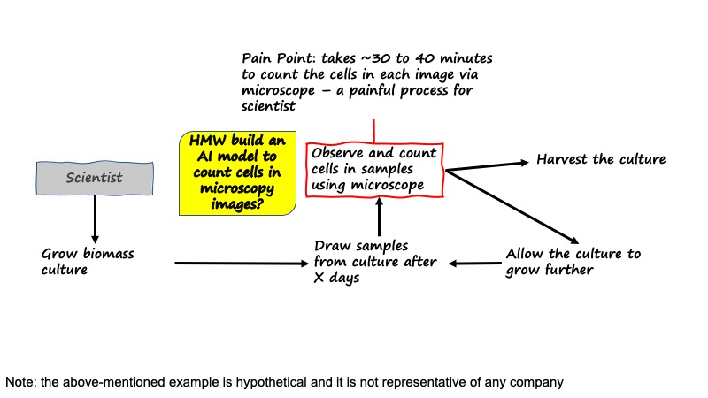

# How does the AI engineer translate the business challenge into an AI problem?
Contributor: Tan Kwan Chet, Lead AI Technical Consultant

---

## Framing Problem Statement from the Business Challenge

Most AI projects begin when a sponsor has 1 or a few business challenges to solve. During early stages of an AI project, the AI engineer needs to explore the data and methologies that can best tackle the AI problem present in business challenges. Understanding business context and process is a great starting point to frame the AI problem. It allows you to understand the sponsor's long term goal and identify the problem statement that affects the sponsor's business or represents a pain point that the sponsor wants to solve.

It takes a lot of creativity to formulate the problem statement. Sponsor tends to speak about their business problems at a high level. So your job is to filter the high level information shared by sponsor to a low level where the problem may relate to their employees who face the pain point on a day-to-day basis. This is important since your AI solution will likely be replacing a repetitive task that their employees may be facing. To form the problem statement, AI Singapore uses concepts from Design Thinking methodology and Design Sprint to help in this could use the following steps (illustrated as a map diagram below):

1. Identify the target audience (e.g. employee)
2. Define the problem from target audience's perspective (i.e. understand their pain point)
3. Understand when and where the problem is ocurring
4. Discover the benefit for the target audience and value for the business
5. Convert the information into a HMW (How Might We) problem statement 

### Example - Map Diagram

## Translation of Problem Statement into AI Problem

Next, it is wise to decompose the problem statement into different technical requirements of an AI problem. This can be done by asking a series of questions to prompt the sponsor to better describe their technical requirements. 

### Example - Translation from Problem Statement to Technical Requirements

Sponsor's Problem Statement: "How might we build an AI model to count cells on microscopy images?"

|  Question | Rationale |Technical Requirement |
|---|---|---|
| What is the main task that you are keen to replace? | This gives you an idea on what is the main task that AI needs to automate |  AI model to detect cells by size |
|  What is the type of the data involved? | By knowing if the data is image/video, text, tabular or multimodal, it will help you narrow down to the appropriate AI domain/models to focus on | Images of cells taken under microscope |
| What is the output required? | By knowing specifically how the business needs the outputs returned to them, it will help you select the correct algorithm and design the appropriate annotation format | Masks drawn around detected cells and size estimated -> Computer Vision instance segmentation model |
| Is the main task achievable by AI model alone?| You can check if there is a need to use heuristic method or rule-based methods in conjunction with the AI model in order to reach the required outcome | Apply pixel:nm size conversion to estimate actual sizes of detected objects and group them into classes |
| How do you envision to use the AI model? | You understand how the sponsor uses the AI model | This gives you an insight into their deployment infrastructures|
| How will the AI model fit into your business processes? | This helps you to understand how the sponsor will use the AI model, in terms of what applications it will connect to, how often inference will be run, and how much human involvement there will be | Description of high level application architecture diagram and infrastructure requirements |

With these, you would have gained a better understanding of the business challenge and how it translates into the AI problem. This will give you a coverage of what the sponsor hopes to achieve from its envisioned AI model. 

## References
- [Sprint: How to Solve Big Problems and Test New Ideas in Just Five Days](https://www.thesprintbook.com/the-design-sprint)
- [Design, Together](https://www.thoughtworks.com/insights/blog/experience-design/design--together)
- [Data Science for Business](https://www.oreilly.com/library/view/data-science-for/9781449374273/)
