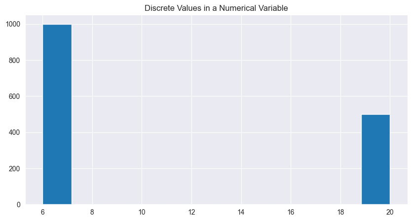
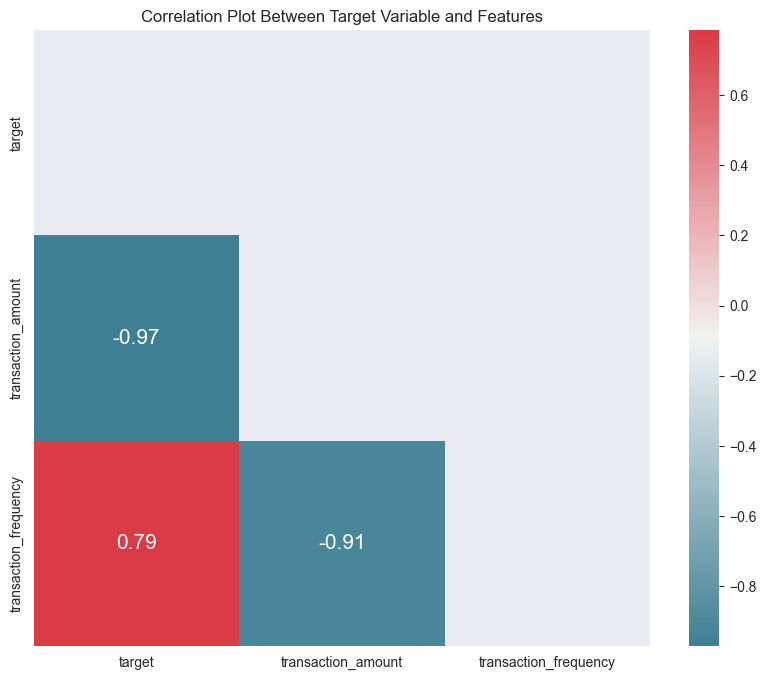
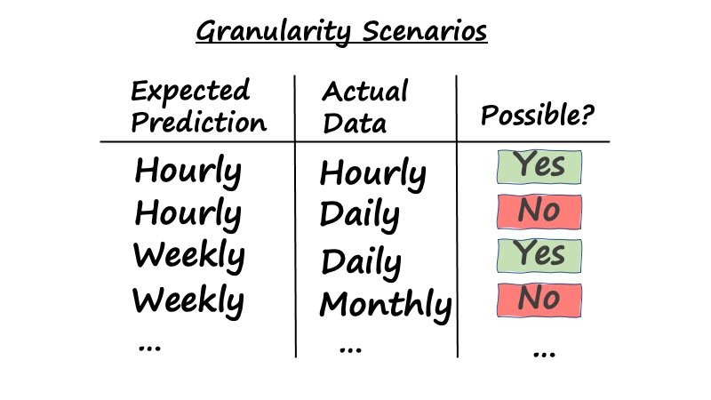
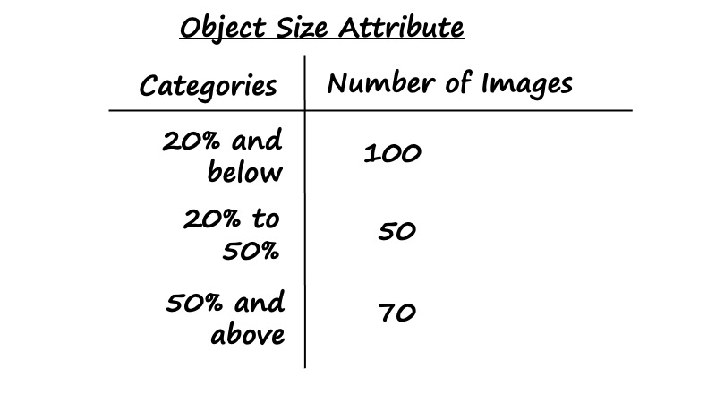

# What are the key areas to look out for in the data when framing the AI project?
Contributor: Tan Kwan Chet, Lead AI Technical Consultant

---
## Key Areas in Data

### Quote from Andrew Ng
> AI systems need both code and data, and “all that progress in algorithms means it's actually time to spend more time on the data,” Ng said at the recent EmTech Digital conference hosted by MIT Technology Review.

### Data Centricity
With the rise of Data-Centric AI (DCAI) since 2021, there is a switch in focus on the code that builds the model to the data that model is trained on. The shift arises because improving the quality of the data could help model to perform better than improving the code. 

### 4 Key Data Questions
Having understood the business challenge and AI problem at hand, this is where you need to delve into understanding the data the sponsor will be providing. You need to assess if there are risks/uncertainties posed within the data collected and annotated for solving the AI problem. Because a good AI model not only relies on algorithms but also quality data.

In practice, there are many considerations and checks for data quality. In this article, we focus on 4 key questions that are highly relevant at the pre-project phase to ensure that the AI problem is feasible and well-scoped. Note that while this is written with a supervised learning approach in mind, most of the considerations are also applicable to other learning approaches.

1. Is the target clearly defined and labels available?

Frequently, sponsor may not be able to articulate the target variable of interest. You will need to explain it as a feature of the dataset that the sponsor is keen to predict. This target variable is related to a business outcome (e.g. reducing employee's repetitive tasks, prioritising patients for treatment based on mortality rate) that the sponsor wants to achieve. 

If the target is of classification nature, it will be ideal to observe the current label proportion (e.g. binary label: "yes", "no") to ascertain if there is presence of label data imbalance. If the label data is highly imbalanced (e.g. 5% positive label and 95% negative label), an alternative would be to reframe the AI problem as an anomaly detection problem. More importantly, you would be keen to confirm if the label data corresponds to the definition of the target and the availability of the label data. 

If the target belongs to a regression type, the question is more about ensuring the target variable is truly numeric/continuous. If upon checking you find that there is only a limited set of discrete values that the target variable can take on, it is better to reframe it as a classification problem. This is a possible scenario in businesses that rely on domain experts to run product experiments by testing different combinations of inputs with varying levels.

  

2. Does the data include features that can predict the target?

An ideal way to estimate if the relevant features are present would be to ask the sponsor the following questions based on a priori domain knowledge: 

- If a human were to perform the task, what information would the person rely on to make the prediction? 
- Is this information available for training the model?

There should be adequate signal and variance within the relevant features. Signal refers to the presence of important information relevant to predicting the target. This can be checked by creating a correlation plot (example chart below) between numerical features and the target variable where the relevant features have a correlation value that is not (or close to) 0. Variance refers to having a sufficient spread of values (eg. straight line and near-constant features are useless for prediction).

  

At times, you will face a situation in which sponsor claims that their domain knowledge is accurate in determining the predictive features while our exploratory data analysis (EDA) lends limited support for it. You could attempt some denoising techniques (e.g. outlier removal, averaging/binning) and check if the correlation improves. If it does not improve, this might be due to some confounding effect of a third feature that may influence the relationship between target and feature of interest. 

3. Is the data at the correct granularity?

It is critical to ensure that the training data and production data share the same level of granularity (e.g. hourly, daily, weekly, monthly or yearly) as what your sponsor expects in prediction. So if the sponsor expects the prediction on an hourly basis and the sponsor collects the data daily, then it will not be possible to build such an AI model to produce a granular prediction based on aggregated data. It is also worthy to note that if expected prediction is at a higher or similar granularity as the training or production data, then it is possible to build an AI model. 

  

Besides matching granularity between training and production data, understanding the correct granularity allows you to estimate the volume of data available for training. For example, if the goal is to aggregate a sensor's readings from seconds to hours for prediction, because the per-second readings contain mostly noise, then having "86,400 data points" may sound like a large dataset, but in actual fact, it is insufficient as there are only 24 hourly aggregates for you to work with.

4. Is the training data representative of the production data?

It is critical that training data is representative of the production data to ensure the trained model can attain decent prediction performances with following considerations:

- Avoid unintended bias. If the model is trained on training data that is dominated by a specific label (i.e. majority label), then it is very likely that the model is robust in predicting a majority label while it will unlikely predict a minority label. 

- Improve robustness and generalisability. The distribution of training data will be what the model will learn from. Assuming that the distribution between training and production data is highly similar, this would mean that the trained model is able to generalise and make robust predictions in varying contexts that are often present in production data.  

- Mitigate "instant drift" the moment when the model is deployed into production. This can be observed by setting up input metrics to monitor the input distribution in production against the one in training or output metrics to check if the model is unable to confidently predict classes across many data points. This would signal a need for retraining the model. 

So how we check for representativeness? To do so, you would need to set the definition of the attributes found in the data:

Once the data definition is set, you could request the sponsor to estimate the proportion of the data by different attributes found in the dataset. For example, if it is a salient object detection task, you should be able to see the attribute distribution of the data.

  

Using these 4 key questions will allow you to have a gauge of the quality of the data for building the model. This is an important starting point for building a model with good predictive power.

## References 
- [Data-Centric AI](https://datacentricai.org)
- [Landing AI](https://landing.ai/data-centric-ai/)
- [MLOps-From-Model-centric-to-Data-centric-AI](https://www.deeplearning.ai/wp-content/uploads/2021/06/MLOps-From-Model-centric-to-Data-centric-AI.pdf)
- [Why it’s time for 'data-centric artificial intelligence'](https://mitsloan.mit.edu/ideas-made-to-matter/why-its-time-data-centric-artificial-intelligence)
- [Is My Data Any Good? A Pre-ML Checklist](https://services.google.com/fh/files/blogs/data-prep-checklist-ml-bd-wp-v2.pdf)
- [What to do After Deploying your Model to Production](https://www.analyticsvidhya.com/blog/2022/04/what-to-do-after-deploying-your-model-to-production/)