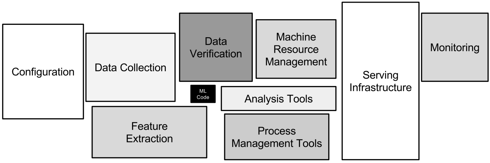

# What are the the considerations for reducing technical debt?

Contributor(s): Dylan Poh Guan Kiong, AI Engineer [(GitHub)](https://unicorndy.github.io/Dylan_Poh/)

---

## What is technical debt?
In software development, technical debt is the accumulation of continuous expenses. It occurs when software engineers prioritise speed of deployment over all other development factors. Fast builds can cause problems that can be very difficult to resolve in the future.

Similar to financial debt, technical debt that is not repaid can accrue "interest," which makes it more expensive to make modifications in future. However, it might not always be a bad thing as developers might intentionally cut corners to produce a proof of concept to advance initiatives.

Martin Fowler offers a more detailed analyses of technical debt quadrant:

|                             |
| :--------------------------------------------------------------------------------------------: |
| *Technical Debt Quadrant [Source](https://martinfowler.com/bliki/images/techDebtQuadrant.png)* |

## Deliberate and prudent technical debt

### Deliberate vs inadvertent
AI engineers may deliberately choose to cut corners, knowing that it would cost them in the long run. For instance, the developer may choose to build and deploy a model without investing in a framework or pipeline, choosing quick release over maintainability. In other words, they consciously trade short-term gains for future expenses.

Junior AI engineers might not fully appreciate the benefit of using version control system and inadvertently decide to develop without the relevant tools. They may later find it impossible to roll back the code when the pipelines are broken.

### Prudent vs reckless
Some engineering choices, like rapidly prototyping a large number of models to choose the best algorithm, hence overlooking a maintainable pipeline could be a prudent decision since they are aware that they are incurring debt and consider the pros and drawbacks of using the best algorithm versus paying it off sooner.  

However, knowing sound software development principles but writing spaghetti code because of a tight schedule could result in reckless debt.

## Technical Debt in Machine Learning
The maintenance/infrastructure expenses associated with machine learning project go well beyond those technical debt associated with standard software projects. Jumping onto the hype train and using machine learning to tackle problems that already have a solution or that can be solved quickly using heuristics may be costly and reckless, but using machine learning to replace repetitious work with labor shortage (such as object detection on defects) will be a deliberate choice with long-term benefits.

|                                                                                                                                                                   |
| :------------------------------------------------------------------------------------------------------------------------------------------------------------------------------------------------------------------------------: |
| *ML Code takes up only a small portion of the whole pipeline, and technical debt can accumulate quickly in other processes. [Source](https://proceedings.neurips.cc/paper/2015/file/86df7dcfd896fcaf2674f757a2463eba-Paper.pdf)* |

## The 25 Best Practices 

Technical debt has already been the subject of [extensive research](https://proceedings.neurips.cc/paper/2015/file/86df7dcfd896fcaf2674f757a2463eba-Paper.pdf). A list of best practices as recommended by [Matthew McAteer](https://matthewmcateer.me/blog/machine-learning-technical-debt/) is provided here:

- Use interpretability tools like SHAP values
- Use explainable model types if possible
- Always re-train downstream models
- Set up access keys, directory permissions, and service-level-agreements.
- Use a data versioning tool.
- Drop unused files, extraneous correlated features, and maybe use a causal inference toolkit.
- Use any of the countless DevOps tools that track data dependencies.
- Check independence assumptions behind models (and work closely with security engineers.
- Use regular code-reviews (and/or use automatic code-sniffing tools).
- Repackage general-purpose dependencies into specific APIs.
- Get rid of pipeline jungles with top-down redesign/reimplementation.
- Set regular checks and criteria for removing code, or put the code in a directory or on a disk far-removed from the business-critical stuff.
- Stay up-to-date on abstractions that are becoming more solidified with time
- Use packages like Typing and Decimal, and don’t use ‘float32’ for all data objects
- Do not leave all works-in-progress in the same directory. Clean it up or toss it out.
- Make sure endpoints are accounted, and use frameworks that have similar abstractions between languages
- Make it so you can set your file paths, hyperparameters, layer type and layer order, and other settings from one location
- Monitor the models’ real-world performance and decision boundaries constantly
- Make sure distribution of predicted labels is similar to distribution of observed labels
- Put limits on real-world decisions that can be made by machine learning systems
- Check assumptions behind input data
- Make sure your data isn’t all noise and no signal by making sure your model is at least capable of overfitting
- Use reproducibility checklists when releasing research code
- Make a habit of checking and comparing runtimes for machine learning models
- Set aside regular, non-negotiable time for dealing with technical debt (whatever form it might take)
  
## Measuring technical debt
Before delving into specifics, this [article](https://proceedings.neurips.cc/paper/2015/file/86df7dcfd896fcaf2674f757a2463eba-Paper.pdf) includes a list of pertinent questions to consider, allowing the reader to get a general idea of the amount of technical debt present in a system:

- How easily can an entirely new algorithmic approach be tested at full scale?
- What is the transitive closure of all data dependencies?
- How precisely can the impact of a new change to the system be measured?
- Does improving one model or signal degrade others?
- How quickly can new members of the team be brought up to speed?

And here is a [paper](https://storage.googleapis.com/pub-tools-public-publication-data/pdf/aad9f93b86b7addfea4c419b9100c6cdd26cacea.pdf) that goes into greater detail and provides additional information about the rubric used to evaluate technical debt.

## References

- [Machine Learning: The High-Interest Credit Card of Technical Debt](https://storage.googleapis.com/pub-tools-public-publication-data/pdf/43146.pdf)
- [Hidden Technical Debt in Machine Learning Systems](https://proceedings.neurips.cc/paper/2015/file/86df7dcfd896fcaf2674f757a2463eba-Paper.pdf)
- [The ML Test Score: A Rubric for ML Production Readiness and Technical Debt Reduction](https://storage.googleapis.com/pub-tools-public-publication-data/pdf/aad9f93b86b7addfea4c419b9100c6cdd26cacea.pdf)