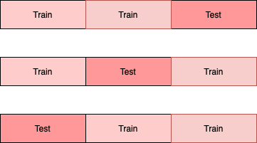
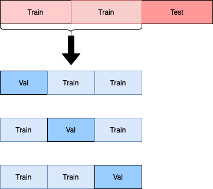
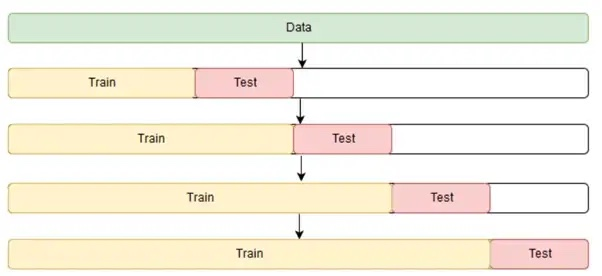

# What are the various data split strategies?

Contributor(s): Lee Xin Jie, Senior AI Engineer (100E)

---

## 1. Static train-test Split
The most common train test split strategy is to create static training, validation and test data sets.

### Train set
The train set is the subset of the data that will be used to train the ML model. The model’s performance on the train set will only provide an indication of how well the model will perform on previously seen data.

### Validation set
The validation set, also commonly referred to as the development set, consists of data that is unseen during model training. It provides an estimation of the model’s performance during production.  The validation set is often used during model hyperparameter tuning and algorithm selection. When performing algorithm selection, it is important to ensure that the validation set used is the same across all algorithms to ensure a fair comparison.

### Test set
The test set is the second hold-out set that will not be used during training. Since the validation set is commonly used to influence the modelling decisions, our ML model pipeline is likely to be biased in performing well on the validation set. Hence, we will need a completely unseen set of data to provide a final benchmark of our model’s performance on unseen data. It is important to not use this test set to influence your modelling decision. Otherwise you will get an inflated sense of how well the model will perform in real life. You should only evaluate your model on the test set during the final step of the pipeline. As such, it is common for the train set performance to be higher than the validation performance, which in turn, should be higher than the test performance.

**Tip**: After finding the best model from validation, it is also good practice to re-run this model (with the best hyperparameters) on the full dataset (train + validation + test) and save the resulting weights for further use.

### Split ratio
There is no single ‘golden’ data splitting proportion. In general, the larger your dataset, the lower the proportion of data you have to set aside for the validation and test sets. If you have a dataset with a billion data points, you could theoretically set aside 1% of the data for the test set, and still have a sufficiently large test set of 10 million data points. Conversely, the smaller your dataset, the larger the proportion of data that should be set aside for your validation and test sets. This will allow you to have a more confident estimation of model performance during production, as your model’s performance will be determined on a larger and more diverse validation/test set. 

One commonly used rule of thumb will be to adopt a 70-20-10 split for your train, validation and test sets respectively. Ultimately, you should prioritise selecting a ratio catered to your needs.

 

## 2. Cross-validation
A single, static validation set could potentially present a biased assessment of model performance. This is particularly the case with smaller datasets where favourable validation performance may arise by chance. 

Cross-validation is an alternative to having a static validation set. In cross-validation, you will conduct multiple rounds of model training, each time with a different section of your dataset serving as the validation set. This will minimise the variance associated with choosing any particular choice of validation set. However, cross-validation does come with the penalty of additional training time. The difference could be significant especially when training large models. So it is usually recommended when you are dealing with a smaller dataset where there could be insufficient samples to form a reliable validation set. In such cases, favourable validation performance may arise by chance due to a higher proportion of 'easier' examples appearing in the validation set, hence the need for cross-validation.

An illustration of this is as follows.
  

Source: [Cross-validation (statistics)](2880px-K-fold_cross_validation_EN.svg.png)

To obtain the final evaluation result, you can take the average of all splits’ test set results. If you are satisfied with this result, you can train the final “champion” model by fitting the model to the entire dataset. This will be the model used for inference.

 

## 3. Nested cross-validation
While cross-validation reduces the amount of overfitting as compared to the use of a static train test split, it does not reduce it completely. This is because the same score is used to select the best model and to evaluate the model.

To overcome it, you may choose to use nested cross-validation, which will separate the score used to select the best model and to evaluate the model. In this approach, the outer loop is used mainly for model evaluation, while the inner loop is used for hyperparameter tuning. 

To illustrate this, let us assume you are using an outer fold of 3, and an inner fold of 3, and you are tuning and evaluating for the parameter *n* for a model. For the outer loop, you will split the dataset into 3 folds, and rotate the test fold for each set.

Taking the first training set, you will further split it into 3 folds with 1 fold serving as the validation set.

You will train a model with a value of *n*, say *n=1*, on the training folds, and evaluate the model on the validation fold. You repeat the model training with the same *n=1* value each time you rotate the validation fold. The mean of the scores across all validation folds will be the validation score for the parameter *n=1*. You will repeat this procedure for all other *n* values, and then select the best *n* value. 

| Train | Test | n | Val Acc | 
|-----------|--------|--------|-----|
| Inn2,Inn3 | Inn1   | 1      | 92  | 
| Inn1,Inn3 | Inn2   | 1      | 90  | 
| Inn1,Inn2 | Inn3   | 1      | 88  | 
| Inn2,Inn3 | Inn1   | 2      | 80  | 
| Inn1,Inn3 | Inn2   | 2      | 83  | 
| Inn1,Inn2 | Inn3   | 2      | 77  | 

| n | Mean Val Acc | 
|---|--------------|
| 1 | 90 |
| 2 | 80 |

Finally, you will train on the full training and validation set with this best *n* parameter, and evaluate on the test set that was set aside initially in the outer fold.

You repeat the same procedure for all iterations of the outer loop, to obtain the final evaluation of the model.

| Train | Test | Best n | Test Acc | 
|-----------|--------|--------|-----|
| Out2,Out3 | Out1   | 1      | 92  | 
| Out1,Out3 | Out2   | 2      | 84  | 
| Out1,Out2 | Out3   | 1      | 88  | 
Mean test accuracy: 88 

When you are satisfied with the results, you can train the final “champion” model by fitting the model to the entire dataset.

The drawback of the nested cross-validation approach is that the training time will even be longer than the standard cross-validation.

**Tip**: In cases of extremely small datasets, you could consider _nested cross-validation_ to maximise the usage of the whole dataset for training, validation and testing.

 

## 4. Stratified Split
For datasets with unbalanced distribution of targets and/or features, you may want to consider stratified splitting. Stratified splitting aims to split your dataset, while maintaining similar proportions of any desired features/targets across your train, validation and test sets. 

An example of a dataset with features that are skewed in their distribution will be a credit worthiness classification problem, where you may have fewer individuals in the dataset with ages of less than 20 years old.  A random split could result in insufficient numbers of them getting assigned to the validation and test sets. If it is critical to model the behaviour of this age group, you can stratify the dataset based on age buckets. Doing so would fix the proportion of each age group getting assigned to each set.

An example of a dataset with imbalanced targets will be a fraud detection dataset, where fraudulent examples are typically the minority. In this case, you will stratify the dataset based on the target.

In general, the larger the dataset, the less likely features and targets will be unevenly distributed across the sets. You should still check your dataset for any uneven distribution in features and targets.

 

## 5. Temporal Split
When you are dealing with problems related to forecasting future values, you may want to consider temporal splitting. As an example, assume you have data from January to April. You may want to set aside data from January to February for your training dataset, March for your validation dataset, and April for your test dataset.

In fast moving environments such as fraud detection and cyber attack classification, bad actors might develop new fraud and cyber attacks techniques. It may be necessary to continuously train the model on the latest data to predict future frauds and cyber attacks, even though the task does not involve forecasting. Evaluating the model on historical frauds and attacks may be insufficient. Hence, you may choose to consider temporal splitting in this scenario.

In scenarios where there are high correlations between successive times, such as in weather forecasting, you will also want to consider temporal splits and avoid placing February 1 in the training set and February 2 in the validation set to minimise data leakage.

For seasonal data, you may want to take seasonality into account when performing temporal splits. As an example, you can place the first 20 days of every month into the training set, the next 5 days into the validation set, and the last 5 days in the test set.

When performing cross validation for temporal data, you cannot simply use random data sampling to assign data points to the training and test sets. This is because there are temporal dependencies between each observation, and you generally want to avoid using future data to predict past data.

For each kth split in temporal cross validation, the first k folds will be assigned to the train set, while the k+1^{th} fold will be assigned to the test set. Hence, all successive training sets are supersets of previous sets.

An illustration of this is as follows.

  
Source: [Cross Validation in Time Series](https://miro.medium.com/max/1204/1*qvdnPF8ETV9mFdMT0Y_BBA.webp)

The steps to obtain the final evaluation results are the same as cross validation. You will likewise obtain the final result by taking the average of all k splits’ tests results.

Similarly, when you are satisfied with the results, you can train the final “champion” model by fitting the model to the entire dataset.

 

## References

- [Building Machine Learning Powered Applications: Going from Idea to Product](https://www.oreilly.com/library/view/building-machine-learning/9781492045106/)
- [Machine Learning Design Patterns: Solutions to Common Challenges in Data Preparation, Model Building, and MLOps](https://www.oreilly.com/library/view/machine-learning-design/9781098115777/)
- [Machine Learning Yearning: Technical Strategy for AI Engineers, In the Era of Deep Learning](https://www.deeplearning.ai/courses/)