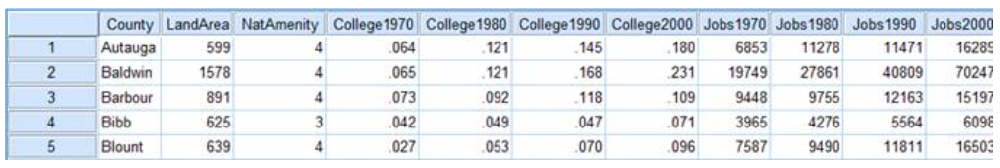
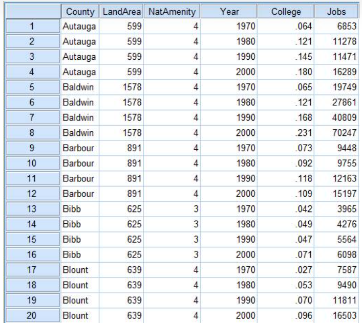

# How can I perform exploratory data analysis systematically?

Contributor: Er YuYang, Senior AI Engineer

The purpose of this article is to have a guide to performing exploratory analysis (EDA) in a more systematic manner. This guide is designed for a generic EDA purpose and primarily focuses on tabular data. However, parts of this workflow are still applicable for unstructured data types.

## Overview
Most EDA activities should contain these blocks:

### 1. Structure investigation

This section contains the most basic checks on the overall completeness of and level of information in the dataset. These includes the checking the data size and type as well as granularity/cardinality of each table. It should also examine if the data contains any private or sensitive data.  

### 2. Content investigation
    
This section looks into the quality, distribution and relationships in the dataset, but not necessarily in this particular order.

#### 2a. Quality checks

This sub-section should cover aspects of data quality such as missing and erroneous values. The main aim is to identify  potential data to drop, repair or impute.

#### 2b. Distribution checks

This sub-section should cover the understanding of each individual features. The main aim is to find out the chracteristics of each feature, and also to uncover trends or patterns in the data.

#### 2c. Relationship checks

This sub-section should cover more in-depth analyses such as bivariate relationships between features, and between features and target. The main aim is to generate ideas for feature engineering and selection based on observed relationships.

## 1. Structure investigation

This section should be short (about less than 10 notebook cells), as it only aims to gain some insights on the size and datatype of the data. This sections does not go into the content of each variable/feature. 

When checking the datatype, organise features according to whether they are numeric/continuous or categorical. This will help to decide on suitable visualisations when performing content investigation later.

When dealing with private or sensitive data, discuss with stakeholder whether masking or removing them is a better option. When duplicate rows are present, highlight them and discuss with stakeholders on how to deal with them. Inappropraite handling of duplicate rows can results in data leakage when performing data split for model training/evaluation.

Some useful Python commands:

    a. df.shape
    b. df.info() or df.dtypes or pd.value_counts(df.dtypes)    
    c. df.head() or df.tail()
    d. sum(df.duplicated())
    e. df.nunique()

Expected ouputs of structure investigation: 

- Raw version of data loaded in the notebook
- Size of data, whether parallel processing is needed
- Datatype of features, which features are numeric/continuous, or categorical
- (Optional) Further discussion with stakeholders on handling private/sensitive data and duplicate rows

### Tips for large data

In the scenario if the data is too huge, explore by sampling or chunking the dataset. Parallel processing libraries like Dask or Ray can also help. For saving big data to disk, other file formats (like Pickle, Feather, Parquest and HDF5) can help to compress and reduce the storage size.

### Tips for performing granularity checks 

This is to understand how fine/coarse each row and column is, and verify whether the table is of the correct granularity per the database schema. These are some checklist questions for granularity checks

- What does a record represent?
  - Is it in wide format? (Repeated responses will be in a single row, and each response is in a separate column.)
    

  - Is it in long/stacked format? (Each row represents one observation per subject)
    

- Do all records capture granularity at the same level?
- If the data were aggregated, how was the aggregation performed?
- What kinds of aggregations can we perform on the data?

### 1c. Tips for performing cardinality checks 

This is to find out the number of distinct values in each features. Consider dropping high cardinality feature(s) that have almost equal or close to number of rows in the dataset. For example, unique IDs and remarks which are generally not useful for EDA as there are no trend in these features.

## 2. Content investigation

### 2a. Quality checks

This sub-section should cover matters relating to data cleaning and imputation. If there are too many missing values, consider dropping the column. However if dropping is not an option, a more sophisticated method for imputing the missing value is to use the other avaiable features to predict the value of that particular column. 

Expected ouputs:
- Cleaned version of data ready for plotting charts
- Identify data/column(s) that requires preprocessing in the datapipeline

#### Tips on missing data

The choice of approach for handling missing data is also influence by the type of "missingness". Before performing any imputation, it is highly recommended to first consult the stakeholder and understand possible reasons behind the missingness. There are three kinds of missing data.

- Missing completely at random (MCAR)
  
  There is no relationship between the missingness of the data and any values observed or missing. There is nothing systemic going on that makes some data more likely to be missing than others.

- Missing at random (MAR)

  A missing observation has nothing to do with the missing values, but it does have to do with the values of the an individual's observed variable(s). For instance, if men are more likely to tell you their weight than women, the weight feature can be considered as MAR.

- Missing not at random (MNAR)
  
  There is relationship between the inclination or natural tendency of the value to be missing and its values. For example, individual with the lowest eduation may have their missing value on the education feature.

Generally, there are 4 ways to impute

- Assign a fixed value(s) based on domain knowledge
  
  Try to obtain the missing data from stakeholder or relevant subject matter expert (SME). For instance, stakeholder might said that the data is for a certain health campaign was for breast cancer screening, hence missing Gender can be imputed as Female.

- Simple imputation based on statistical summaries

  For numerical features, impute using mean or median of that feature. For categorical features, impute using mode (most frequent) of that feature.

- Model-based imputation

  Using other available features as predictors (eg. MissForest: see article link at reference section).

- Multiple imputation 

  Most sophisticated imputation method, more time consuming but has unbiased outcome. It takes random samples for each imputation, and take the average of the predictions from each imputation (see video link at reference section).

#### Tips on cleaning categorial features:

Perform cardinality checks on categorical features, as there could be similar categories due to spelling mistake or variations. Cleaning these erroneous category will help to reduce unnecessary noise in the analysis. It also helps to assess whether some categories are too sparse and may need to be merged for greater statistical power.

At the same time, determine if the categorial features should be later mapped as ordinal or nominal. Converting categorial into numerical helps to include these catagerial features in the pairwise coorelation algothrim.

Sample Python command:
```python
categorical_columns = ['<column1>', '<column2>', ..., '<columnN>']
for column_name in categorical_columns:
  print(df[column_name].unique())
```

#### Tips on cleaning multiple currency types in same column:

If multiple currencies are involved as a single feature, make sure to convert them into the same currency in the same column, otherwise the scale of the different currencies will cause confusion during EDA and model training.

### 2b. Distribution checks

This sub-section should cover the generation of the distribution and summary statistics. Understanding properties like central tendency (mean), spread (variance) and skewness help you to spot erroneous values and potential outliers easily.

If there are district groups in the data, try grouping them and perform individual analysis for each group, in additional to the entire data analysis. Try to use looping to cover the entire possible combinations when plotting charts that compare two features instead of selecting particular features combination that you preceive is useful. Investigate further if certain combination of features have interesting results. 

Highlight the findings on the notebook regardless of whether they are useful. This allows the reader to understand the purpose of the charts.

The analysis should cover the following:
- Summary statistics of the features
- Distribution of the features
- Feature patterns (trend)

Expected ouputs:
- Characteristics of each feature
- Spotting potential outliers and erroneous values
- Summary of the findings
- Potential feature characteristics that can be used for feature transformation in the data pipeline

#### Tips on summary statistics

Perform summary statistics separately on numerical and categorial features, as certain statistics is not useful for categorical (eg. no percentiles for categorical) and vice versa (eg. no frequency and unqiue count for continous numerical values).

Python commands for reference:

For numerical features:

    a. df.describe(include=[np.number]) 
    b. df.numeric.describe()
    c. df.describe(percentiles=[.1, .5, .9]))

For categorical features:

    a. df.describe(exclude=[np.number])
    b. df.describe(include=[object])  

Others:

    a. df.describe(include='all')
    b. df.describe(datetime_is_numeric=True)

#### Tips on univariate plots

- Histograms are great for viewing distribution of features, and comparing 
between different group of data.

Sample python command for choosing bin size
```
sns.displot(df, x="<column_name>", binwidth=3)
sns.displot(df, x="<column_name>", binwidth=20)
```

- Kernel density estimation (KDE)
  
A kernel density estimate aims to approximate the underlying probability density function that generated the data by binning and counting observations.

Sample python command for choosing smoothing bandwidth
```
sns.displot(df, x="<column_name>", kind="kde", bw_adjust=.25)
sns.displot(df, x="<column_name>", kind="kde", bw_adjust=2)  
  ```

- Stacked chart: Can cause confusion; avoid using if possible.

- Line chart: Commonly use in time-series data, mainly use to observe trend over a time period.

- Pie chart: Not recommended, use only if there is a need to compare the size of each category.

- Box plot: Useful for identify 25%-50%-75% mark and outlier(s), only if the outlier is not extreme. Especially useful for indicating whether a distribution is skewed.


### 2c. Relationship checks

This section aims to find out the relationship between feature and target so as to generate ideas for feature engineering and selection (feature importance). The goal is to identify correlated features or categories. Correlated features distort interpretability and feature importance. As such, it is worth exploring dropping or merging collinear features based on domain knowledge. 

In the scenario if there are too few features in the data, feature engineering should be explored. Conversely if there are too many features, feature importance should be explored and then dropping less important features.

The analysis should cover the following:
- Relationships between each feature and the target
- Relationships between features

Expected ouputs:
- Identify features that are positively/negatively correlated to each other
- Identify features that are positively/negatively correlated to the target label
- Summary of the findings
- Ideas on feature engineering/selection

#### Tips on the pairwise correlation
- Categorical vs categorical

  - Crosstabs

    Compute a simple cross tabulation of two (or more) factors.

    Sample Python command:
    ```
    s1 = pd.Categorical(['p', 'q'], categories=['p', 'q', 'r'])
    b1 = pd.Categorical(['s', 't'], categories=['s', 't', 'u'])
    pd.crosstab(s1, b1, dropna=False)
    ```

- Numerical vs numerical correlation 

  - Spearman & Pearson correlation 
    
    Outputs a single numerical value denoting the strength of correlation. Pearson's correlation works with a linear relationship between the two variables, whereas Spearman coefficient works with monotonic relationships as well.
  
  - Pairwise scatterplot (such as `seaborn.pairplot`)

    Shows distribution of both features. Strength of correlation can be assessed visually.

- Categorical & numerical correlation

  - Phi_K correlation matrix

    Phi_K is a correlation coefficient between categorical, ordinal, and interval variables with Pearson characteristics (see article link at reference section)

  - Preprocessing method  

    Convert categorical to numerical forms using techniques such as ordinal or nominal encoding, and then normalize to the same scale so that they can be used for numerical vs numerical correlation.

#### Tips on the bivariate/multivariate correlation

For comparing specific features

- Scatter plot 
  
  Useful for examining up to 3 features together, with hue as the 3rd feature. The hue feature can be categorical instead of numerical.

- Joint plot

  Combination of scatter and distribution plot of first two features, with hue as the 3rd feature. The additional distribution information can be useful as multiple points with identical values are not easily detected in scatter plots.

- Joint grid

  Combination of scatter and box plot of 2 features. Great for identifying 25%-50%-75% mark as additional information.

- t-SNE plot 
  
  Useful for examining features above 3 by compressing the multiple features into 2 dimension and hue as the target feature. This allows you to immediately discern whether the classes are separable based on the features.

#### Tips on feature engineering

Try to link insights from EDA to feature engineering. For example, if you find that number of deliveries (the target) is much higher on Mondays compared to the rest of the week, you could engineer a separate feature is_monday to boost the model’s performance. 

If certain featurse have a very similar relationship to the target and are sparse, you could merge them during feature engineering to create a stronger feature.

# Others
Pandas Profiling and Google Facets are 2 excellent tools for performing EDA.

Pandas Profiling: 
- https://www.analyticsvidhya.com/blog/2021/06/generate-reports-using-pandas-profiling-deploy-using-streamlit/
- https://pypi.org/project/pandas-profiling/

Google Facets: 
- https://towardsdatascience.com/visualising-machine-learning-datasets-with-googles-facets-462d923251b3
- https://github.com/PAIR-code/facets

## References
### Articles
https://miykael.github.io/blog/2022/advanced_eda/  
https://www-users.york.ac.uk/~mb55/intro/typemiss4.html  
https://towardsdatascience.com/missforest-the-best-missing-data-imputation-algorithm-4d01182aed3  
https://seaborn.pydata.org/tutorial/distributions.html  
https://www.analyticsvidhya.com/blog/2022/02/a-quick-guide-to-bivariate-analysis-in-python/  
https://towardsdatascience.com/phik-k-get-familiar-with-the-latest-correlation-coefficient-9ba0032b37e7  

### Video
https://www.youtube.com/watch?v=LMsULWGtP2c  