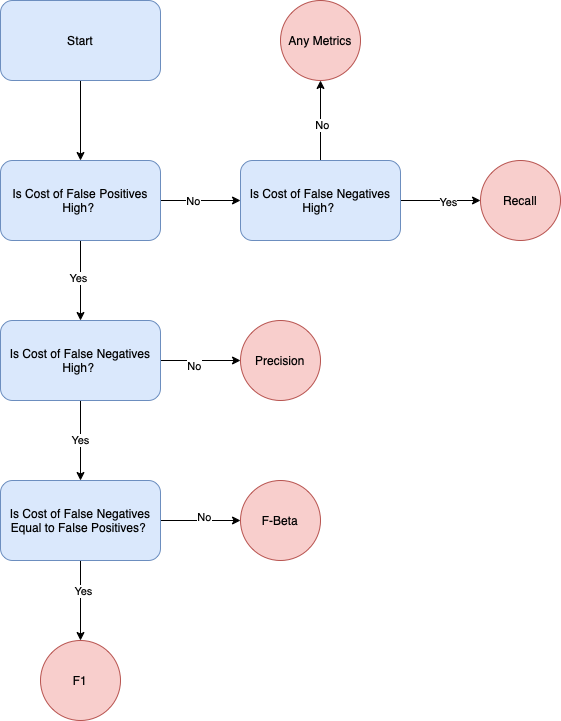
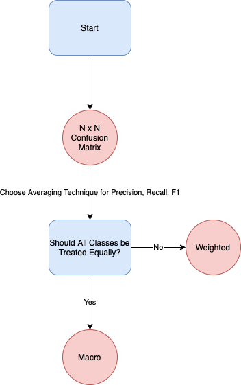
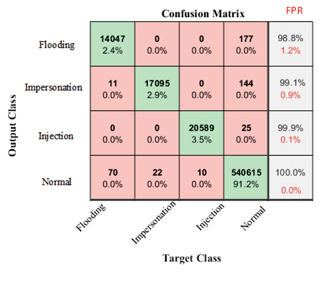

# How do I select classification metrics?

Contributor(s): Lee Xin Jie, Senior AI Engineer (100E), Er YuYang, Senior AI Engineer (100E)

---

## Introduction
The common classification evaluation metrics includes accuracy, confusion matrix, precision, recall, F1, ROC & AUC, precision-recall curve. 

This chapter will not elaborate on the definitions of the above mentioned evaluation metrics, as there are numerous resources available for this topic. Instead, this chapter will introduce best practices regarding the selection of classification metrics. This will serve as an extension of the previous chapter [What are some internal and external considerations when selecting evaluation metrics](optimising-and-satisficing.md), and the concepts discussed here can extend through various domains, be it Natural Language Processing, Computer Vision, etc.

 

## Imbalanced datasets

While accuracy is the most common classification metrics, it can be misleading for imbalanced datasets. For example, consider a fraud detection problem where only 5% of the labels are fraudulent. If the model predicts every example to be non fraudulent, it will achieve an accuracy of 95%, which can be very misleading.

In such situations, you may want to consider using precision, recall and F1. Precision measures of all your model’s positive predictions, how many of them are correct. Recall measures of all the actual positive examples, how many of them were identified correctly by the model. 

Precision is more important than recall when you cannot afford to have any False Positives as compared to False Negatives. Do take cost into consideration when deciding if precision or recall is more important. When the cost of acting is high and the cost of not acting is low, then precision is preferred. Recall is more important than precision when you cannot afford to have any False Negatives as compared to False Positives. It is more important when the opportunity cost of passing up is high.

The F1 score, also known as F-score, is the harmonic mean of precision and recall. F1 can be computed with the formula. You should choose this metric if you want to balance both precision and recall.

$F_1 = 2 \cdot \frac{precision \dot recall}{precision + recall}$

Since there is often an inverse relationship between precision and recall, you might want to weigh one more over the other. This will likely depend on the client’s needs, hence do check with them on their needs before proceeding. You may also want to consider the $F_{\beta}$ score:

$F_{\beta} = (1 + \beta^2) \cdot \frac{precision \cdot recall}{ (\beta^2 \cdot precision) + recall }$

where $\beta$ is chosen such that recall is considered $\beta$ times as important as precision.

### Why not ROC?
 The ROC curve, also known as the receiver operating curve, plots the true positive rate (TPR) vs the false positive rate (FPR) over all classification thresholds from 0 to 1. The AUC, also known as the area under the curve, measures the aggregated performance of your model over all classification thresholds.

 The ROC curve, as well as the AUC score, can be misleading in imbalanced datasets. As an example, assume that the positive class is the minority class in an imbalanced dataset.  Because the negative class has a lot of examples for the model to learn, the True Negatives are typically very high, especially when compared to the number of false positives. This means that the FPR will likely be low even when there are alot of false positives. Hence this implies that it is possible for a low precision model to achieve a good ROC curve and a high AUC score.  

 To illustrate this, assume there are 10 positive examples and 1000 negative examples. There are 9 True Positives, 1 False Negative, 100 False Positives and 900 True Negatives. The TPR is 0.9 while the FPR is 0.1. Since the TPR is high and the FPR is low, the AUC is likely high. This does not mean that the model is good, as the model’s precision is relatively low. In such a scenario, it is preferable to look at the precision recall curve which plots the precision and recall across all thresholds. Likewise, you are also able to compute the AUC of the precision-recall curve, which you can use to compare the performance of various models.

 

## Multi-class datasets

In multi-class classification, the first evaluation metric you may want to consider is an N $\times$ N confusion matrix. An example of which is shown below.

Source: [Artificial Intelligence Technique for Gene Expression by Tumor RNA-Seq Data: A Novel Optimized Deep Learning Approach](https://www.researchgate.net/profile/Tahmina-Zebin/publication/332526113/figure/fig4/AS:762078440747009@1558705067842/Confusion-matrix-of-the-test-dataset.ppm)

With an N $\times$ N confusion matrix, you can quickly identify which classes are performing well, or which classes are commonly misclassified as another class, etc.

To extend precision, recall and F1 to the multi-class domains, we can first compute these scores on a per class basis by using the one-vs-rest approach. This is akin to treating the evaluation of multi-class problems as the evaluation of multiple binary classes.

If you need a single score to compare models, you can compute the averages of precision, recall and F1 using three different averaging techniques.
1. Micro: Computes metrics globally by counting the true positives, false positives and false negatives.
2. Macro: Computes the unweighted mean of the metrics for all classes, disregarding class imbalance.
3. Weighted: Computes the metrics for each class, then finds their average weighted by support (the number of true instances for each label).

The choice of which averaging techniques to use depends on the business objective. If you prefer to treat all classes equally, regardless of their sample size, you can opt for macro-averaging. This could be for situations where the minority class performance is very important to the project sponsor. 

On the other hand, if it is acceptable to treat each class’s importance based on the class size, you can opt for weighted- or micro-averaging. Do note that for multi-class problems, the micro-averaged F1 score will be the same as the global accuracy.

 

## Multi-label datasets
For multi-label problems, you can extend the binary classification metrics by computing each metric per class. This is no different from a binary classification problem. For example, you can compute precision, recall, F1, confusion matrix for each of the classes in a one vs rest approach.  Once you have obtained each class’s metrics, you can compute the averages across all classes with the same averaging techniques as covered for multi-class problems: micro, macro, weighted averaging. Note that for multi-label problems, the micro-averaged F1 score is not the same as accuracy.

 

## References

- [Comprehensive Guide to Multiclass Classification Metrics](https://towardsdatascience.com/comprehensive-guide-on-multiclass-classification-metrics-af94cfb83fbd)