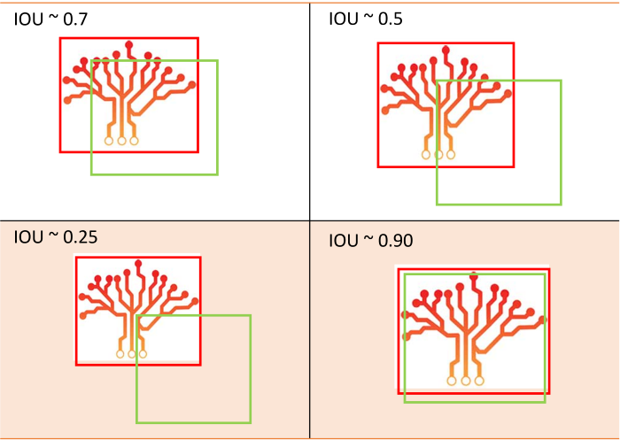

# What are the common CV evaluation metrics?

Contributor(s): Calvin Neo, AI Engineer

---

This guide assumes a fair understanding of the computer vision-related tasks specifically image classification, object detection, and instance segmentation and their accompanying terms such as bounding boxes (bboxes) and masks. Additionally, it assumes an understanding of classification metrics such as F1 score, precision and recall. 

# Image Classification

Conventional classification metrics can be used to evaluate image classification tasks. 

# Object Detection and Instance Segmentation

Generally, object detection and instance segmentation tasks employ the same metrics. 

## Intersection over Union (IOU)

IOU is not a metric. It is a threshold set to be used by other metrics to evaluate the model's performance.  
When a model makes an inference on an image to identify objects of interest within the image, it would draw a bbox/mask over the object.  
At the same time, there is also a ground truth (GT) bbox/mask to be compared against the inferred bbox/mask. Usually, these bboxes/masks do overlap but not completely. IOUs are thresholds for whether to accept the level of overlap. For example, if the overlap is 40% (0.4), this would fail the threshold.

IOU is calculated as such: 

$IOU = \frac{\text{Area of Overlap}}{\text{Area of Union}}$  

### Obtaining Positive and Negative from IOU

With the IOU obtained from the model and the GT, the predictions would then be labelled either True/False Positive or False Negative. Note here that True Negative is not considered. The simplest to understand this is that True Negative is saying that the model infer that a particular spot if background and confirmed by the GT, which is not a useful measure of a model's performance. 

The below table illustrates, based on IOU and the class prediction, which each inference falls under.

| IOU   | Positive                                                                   | Negative                                              |
|-------|----------------------------------------------------------------------------|-------------------------------------------------------|
| True  | 1. IOU $\geq$ IOU Threshold   2. Correct Class    3. Not duplicate   | Not applicable                                        |
| False | 1. IOU < IOU Threshold   2. Duplicate                                   | 1. IOU $\geq$ IOU Threshold   2. Incorrect Class   |

## Mean Average Precision and Recall

Mean Average Precision (mAP) assumes knowledge in Precision and Recall. mAP averages the average of the Precision of the model at each class.

To illustrate this point, consider the case where IOU threshold is set at 0.5. This means all bboxes with IOU less than 0.5 will be False Positive. Suppose there is an image which has ten instances of a class "A". The model was able to correctly identify 5 of the "A"s while inferring the rest as "B"s (in this case, class does not matter, as long as it is not "A"). 

## Thresholds - IOU, Confidence and Non-max Suppression (NMS)

## Frames Per Second

## Choosing Precision or Recall

Choose Precision if the priority of the model is to identify objects. 
Choose Recall if the priority of the model is to identify objects and their class correctly.