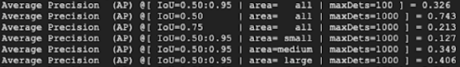

# What are the common CV evaluation metrics?

Contributor(s): Calvin Neo, AI Engineer

---

This guide assumes a fair understanding of the computer vision-related tasks specifically image classification, object detection, and instance segmentation and their accompanying terms such as bounding boxes (bboxes) and masks. Additionally, it assumes an understanding of classification metrics such as F1 score, precision and recall. 

The purpose of this article is to guide AI engineers on key considerations when evaluating metrics for object detection and instance segmentation tasks. For the most part, conventional classification metrics can be used to evaluate image classification tasks. Hence, an understanding of image classification would be useful hre. In this case, refer to the article on Classification metrics.

## Mean Average Precision (mAP)

There are many articles on how to calculate mAP available. It is thus instructive to instead discuss considerations when reading mAP.

In discussing considerations on evaluating mAP, consider the mAP output below:

Firstly, it is useful to evaluate the Intersection over Union (IOU) threshold value to understand how "tight" a bbox/mask. A higher IOU threshold value indicates that the model's inference closely overlaps with the ground truth. Generally, the mAP suffers as the IOU threshold value increases. Thus, evaluating how much these values fall would be valuable clues on how much the model can produce good bboxes/masks.

Using the outputs above, the second row shows that at IOU threshold of 0.50, the mAP is given by 0.743. Similarly, the third row showing IOU=0.75 threshold shows 0.213, a 0.53 fall in value. This shows that the bboxes/masks are not tight enough, and more training may be required. 

Secondly, the objects being detected can be broadly separated to small/medium/large objects based on the bbox/mask size. Here, it is assumed the small/medium/large are area of the bbox/mask, and that area threshold for these sizes are clearly defined (see CV EDA article to guide the size of these annotations). 

A model generally performs the worst on small objects and gets better as the size increases. Thus, evaluating this is also instructive. Considering the above outputs, the mAP is 0.127/0.349/0.406 on small/medium/large objects. Thus, it would be good to have the model be trained on more small objects in order to potentially improve its performance. 

## Frames Per Second (FPS)

FPS are generally measured by running multiple images through the pipeline and obtaining the amount of time taken to process each image, before converting it to frames per second. The way to do it is: 

$FPS = \frac{1}{\text{Average Time Taken Per Image}}$

Here, the AI Engineer would need to consider the following:

Firstly, FPS could calculate only models' inference speed and or the architecture's speed. This is obvious but often overlooked. When delivering the model, the onus is on the AI Engineer to communicate how the FPS was measured. 

Secondly, it is important to consider what affects FPS. The first factor would be model size. A model that is deep, and hence tend to be larger in size, requires a longer processing time. Another factor is image size. Larger image size will take longer for inference. For example, a 416x416 image will be faster than 1080x960 image. While this is obvious, it is also often overlooked by AI Engineers when reading papers that purport higher inference speeds, but downplays the role that smaller images have on inference speed.  

# Error Analysis 

## Thresholds - Confidence and Non-max Suppression (NMS)

## Choosing Precision or Recall

Choose Precision if the priority of the model is to identify objects. 
Choose Recall if the priority of the model is to identify objects and their class correctly.

