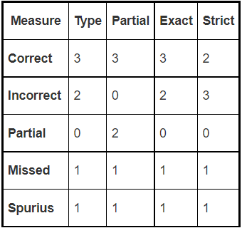
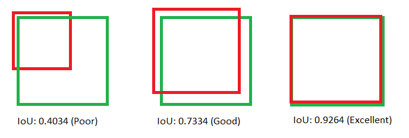
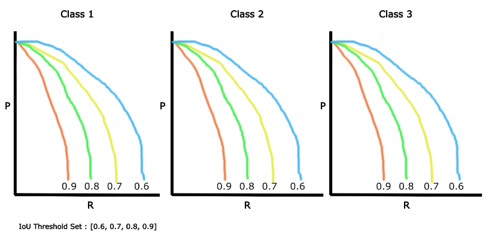

# What are the considerations (internally by the team), and externally (by the shareholders) when selecting evaluation metrics?

Contributor(s): Er YuYang

This guide assumes that you have a fair understanding of why the stakeholders is developing the AI/ML project (understand the business value), and have a reasonable understanding for the implementation difficulty of the evaluation for given the dataset.

# High level metrics (for classification problems)
This section covers some of the most common metrics used for evaluating model for classification problems. Do note that this is not exhaustive list but covers the some of common high level metrics that are useful when communicating with stakeholders.

1. Accuracy = $\frac{TP + TN}{TP + FP + TN + FN}$
   
   Simple for explaining to stakeholders but not suitable if the dataset is unbalanced.

2. Precision = $\frac{TP}{TP+FP}$

   Simplified explaination: Out of the <u>positive predictions</u>, how many are correct. It focuses on finding positive cases.

3. Recall = $\frac{TP}{TP+FN}$

   Simplified explaination: Out of the <u>actual positive</u>, how many are correct. It focuses on weeding out the negative cases.

4. F1 Score = 2 * $\frac{Precision * Recall}{Precision + Recall}$
   
   F1 score is the weighted mean of precision and recall

Precision is more important than recall when you cannot afford to have any FP as compare to FN. Often associate with cost, when cost of acting is high but the cost of not acting is low, then precision is preferred. Recall is more important than precision whe you cannot afford to have any FN as compare to FP. It is more important when the opportunity cost of passing up is high. 

Example: Missing out to detect spam email is okay but missing out of detecting fraud or disease is high (use recall metrics for the latter). Finding as many spam email is desirable than missing out to detect spam email (use precision). 

If both Precision and Recall are equally important than F1 score should be used. There are variation of F1 score: 
- micro (globally by counting total positive)
- macro (calculate f1 for each label then complete <u>unweighted</u> mean)
- weighted (calculate f1 for each label then complete <u>weighted</u> mean)

Use weighted f1 when data is unbalanced.

5. Others common metrics

    a. ROC curve (receiver operating characteristic curve) 

    b. AUC (Area Under the ROC Curve)

    c. Confusion matrix

    d. Loss functions

Confusion matrix may be required in there is a need to see the exact number of TP, TN, FP, FN, sometimes uses for more technical-inclined stakeholders. Both metrics in 5a & 5b requires predicted labels & predicted probabilities in order to plot curve, avoid using when extracting proabilities is not possible or difficult. For loss functions, there is binary cross-entropy and multi-class entropy for binary/multi-class classification problems. These metrics are often used by internal development team.

# High level metrics (for regression problems)
This section covers some of the most common metrics used for evaluating model for regression problems. 

1. Mean Square Error (MSE)

   Average of the squared differences between the actual and the predicted values. The lower the value, the better the regression model. It penalizes the outliers most.

2. Root Mean Square Error (RMSE)
   
   Square root of MSE, used when MSE value is too big for comparsion

3. Mean Absolute Error (MAE)

   Similar to Mean Square Error (MSE) but taking sum of absolute value of error. MSE gives larger penalization to big prediction error as compare to MAE.

MSE, RMSE, MAE are not very useful when comparing against different models when outliers that is presented very extreme.

4. R2
   
   One of the popular metrics, express as percentage. Large R2 value indicates a better fit, the closer to 1, the better the regression model. Easier for comparsion against different models as it ranges from 0 to 1.  

5. Adjusted R Square

   Similar to R2 but adds precision and reliabilty by considering additional independent variables that tend to skew the results of R-squared measurements

# In-depth metrics
This section covers brief introdution of the in-depth metrics used in different AI domain. Do note that this is not exhaustive list.

1. Evaluation metrics for NER
   
   Involves classification of phrases in sentence (phrase level classification). Both MUC and SemEval are used together as phrase level classification as NER's evaluation metrics.

   - Message Understanding Conference (MUC)
     
     Used for measuring the prediction class against true label class 
     - Corrrect (COR): Both prediction and true labels are the same
     - Incorrect (INC): Prediction and true labels do not match
     - Partial (PAR): Some of the text in the prediction matches the true labels
     - Missing (MIS): No prediction from model when there is true labels
     - Spurius (SPU): Wrong prediction when no true labels

   - International Workshop on Semantic Evaluation (SemEval)

     Used as different evaluation scheme (strict or lenient) for the length of the words (correctness of the phrase) and classification type (correctness of the phrase classification)
     - Strict: Same length of words, correct type
     - Exact: Same length of words, correct/incorrect type
     - Partial: Different length of words, correct/incorrect type
     - Type: Different length of words, correct type

   

2. Evaluation metrics for Object Detection
   
   - Intersection over Union (IOU): evaluates the degree of overlap between the ground truth bounding box with the prediction bounding box

     IoU = $\frac{Area of overlap}{Area of union}$

     

   - Average Precision (AP): Area under the precision-recall curve evaluated at IOU threshold. eg. AP50 means IoU above 0.5 is TP while
   AP75 mean IoU above 0.75 
   
      

   - Mean Average Precision (mAP): AP is calculated individually for each class, then performed averaging of AP values over all classes

# Reference
https://www.davidsbatista.net/blog/2018/05/09/Named_Entity_Evaluation/

https://towardsdatascience.com/iou-a-better-detection-evaluation-metric-45a511185be1