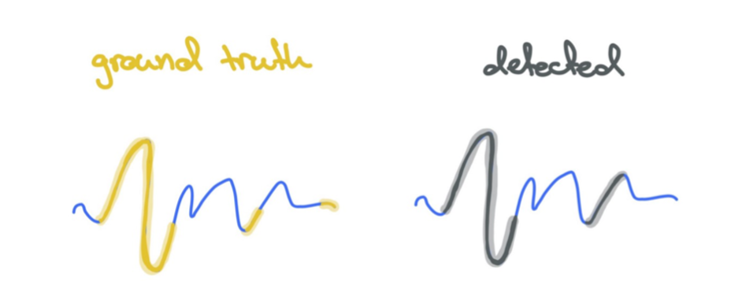
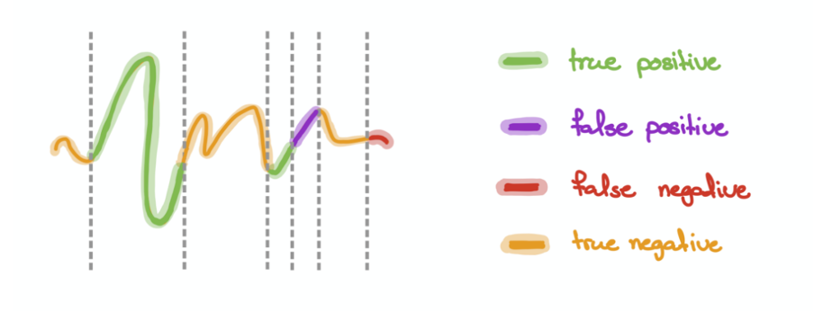
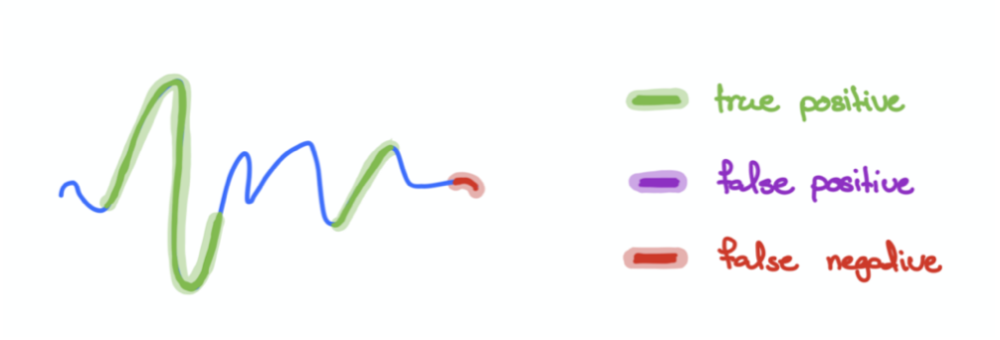

# How can we better evaluate time-series classification models?

Contributor(s): Andy Ong, AI Engineer

---

This guide assumes that you have a fair understanding of typical classification evaluation metrics. This [article](eval-metrics.md) provides a high-level discussion of the various evaluation metrics used in most projects.

# Time-series classification

Time-series models can be evaluated using conventional regression and classification evaluation metrics. For regression problems, we can use Mean Squared Error (MSE) or Root Mean Square Error (RMSE). This article focuses on time-series classification problems, where the outcome to be predicted/forecasted is categorical. Recall, precision or F1 can be used to evaluate classification models, depending on business needs. 

For a time-series classification project, a simple approach is to view every timepoints individually, and evaluate the model by looking at its F1 Score or precision and recall (similar to a non-time-series classification problem).

However, these evaluation metrics might not be adequate to fairly assess time-series models. Firstly, this approach is susceptible to noise. Moreover, it also ignores the autocorrelated nature of time-series data. This autocorrelatio tends to result in sequences of points falling into the same class, rather than one-off occurrences.

## Time segments

Consider the following anomaly detection example:

  
[Image credit](https://medium.com/mit-data-to-ai-lab/time-series-anomaly-detection-in-the-era-of-deep-learning-64b9d2cff6eb)

Here we have 3 ground truth anomalies, and 2 predicted anomalies.

In this approach, we will view timepoints as segments. In the graph below, there are 7 segments, which consist of 2 True Positives (TP), 1 False Positive (FP), 1 False Negatives (FN) and 3 True Negatives (TN). Note that each segment is equally treated as a single instance regardless of its length. This prevents excessive emphasis on long segments.

  
[Image credit](https://medium.com/mit-data-to-ai-lab/time-series-anomaly-detection-in-the-era-of-deep-learning-64b9d2cff6eb)
    
## Overlapping segment

Another way would be to view any “overlapping” predictions between the ground truth and predictions as 1 continuous True Positive.

  
[Image credit](https://medium.com/mit-data-to-ai-lab/time-series-anomaly-detection-in-the-era-of-deep-learning-64b9d2cff6eb)

Taking the above diagram as an example, we can see that there are 2 True Positives. Unlike the earlier approach, no False Positives are recorded here as the relevant ground truth and predicted segments are overlapping. This approach is more lenient, and it rewards the model for *any* successful detection of anomalies.

## Case study

Consider the following case study to contextualise the two approaches described earlier

Company A is attempting to build an anomaly detection model to predict machinery failures. The ground truth and model prediction values for their model are as follows:

|              | T = 0 | T = 1 | T = 2 | T = 3 | T = 4 | T = 5 | T = 6 | T = 7 |
|--------------|------ |------ |------ |------ |------ |------ |------ |------ |
| Ground truth |   0   |   0   |   1   |   1   |   0   |   0   |   0   |   1   | 
| Detected     |   0   |   0   |   0   |   1   |   0   |   1   |   0   |   1   |
*1's denote anomalies*

The confusion matrices below are calculated using the time segment and overlapping segment approaches.

From the table above, we can see that the overlapping approach resulted in a recall of 1.00, which is more lenient as compared to the weighted segment (0.66). As Company A is planning to use the model to detect critical and costly machinery failures, it is not wise to use such a lenient approach like overlapping segment. Instead, the more stringent time segment approach is more appropriate.

This case study demonstrates how business needs must be taken into consideration when deciding the most suitable evaluation approach is suitable for your time series classification project. 

# References

[Time series anomaly detection—-in the era of deep learning](https://medium.com/mit-data-to-ai-lab/time-series-anomaly-detection-in-the-era-of-deep-learning-64b9d2cff6eb)