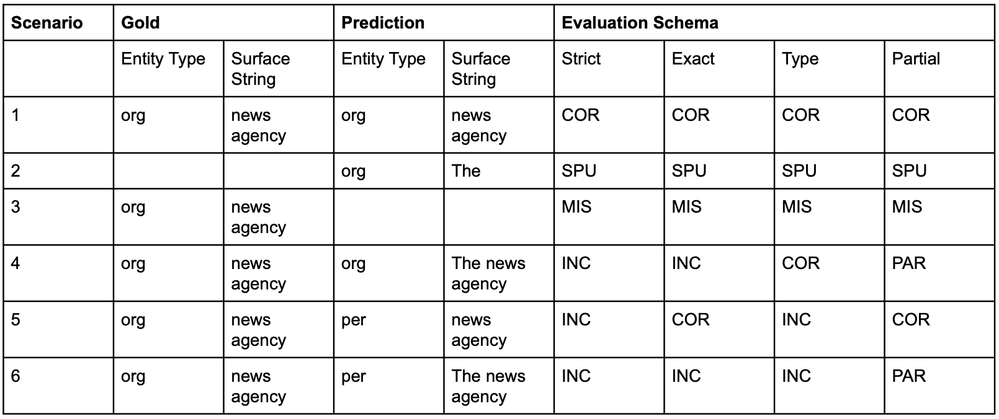

# What are some of the common NLP metrics

Contributor(s): Lee Xin Jie, Senior AI Engineer (100E)

## NER
NER can be thought of as a token level classification problem. Hence, NER models are often tuned using metrics such as F1, precision, recall at a token level during model training. When it comes to evaluating NER models on their downstream tasks’ performance, it may be more beneficial to evaluate NER models at a full named-entity level. There are multiple evaluation schemes for evaluating NER models at a full named-entity level. 

This article will focus on the SemEval (International Workshop on Semantic Evaluation) scheme, which is one of the most popular schemes. In the SemEval scheme, there are 4 ways of measuring F1, precision and recall. A detailed explanation can be found in this [blog](https://www.davidsbatista.net/blog/2018/05/09/Named_Entity_Evaluation/). 

| Evaluation Scheme | Explanation |
|-------------------|-------------|
| Strict | Exact boundary surface string and entity type |
| Exact | Exact boundary match over the surface string, regardless of the type |
| Partial | Partial boundary match over the surface string, regardless of the type |
| Type | Some overlap between the system tagged entity and the gold annotation is required |
[Source](https://www.davidsbatista.net/blog/2018/05/09/Named_Entity_Evaluation/)

The SemEval scheme is built off the MUC scheme which defines the following metrics.

| Evaluation Scheme | Explanation |
|-------------------|-------------|
| Correct (COR) | Both are the same |
| Incorrect (INC) | The output of a system and the golden annotation don’t match |
| Partial (PAR) | System and the golden annotation are somewhat “similar” but not the same |
| Missing (MIS) | A golden annotation is not captured by a system |
| Spurius (SPU) | System produces a response which doesn’t exist in the golden annotation |
[Source](https://www.davidsbatista.net/blog/2018/05/09/Named_Entity_Evaluation/)

To illustrate this with examples, consider the following phrase with its labels.

| Token | Gold Labels |
|-------|-------------|
| The | Other |
| news | Org |
| agency | Org |

Next, we compute the total number of gold annotations with the formula:

$Possible (POS) = COR + INC + PAR + MIS = TP + FN$

The total annotations produced by the system is:

$ACTUAL (ACT) = COR + INC + PAR + SPU = TP + FP$

To compute the precision and recall for Strict and Exact:

$Precision = \frac{COR}{ACT} = \frac{TP}{TP + FP}$

$Recall = \frac{COR}{POS} = \frac{TP}{TP + FN}$

To compute the precision and recall for Partial and Type:

$Precision = \frac{COR + 0.5 \times PAR}{ACT} = \frac{TP}{TP + FP}$

$Recall = \frac{COR + 0.5 \times PAR}{POS} =  \frac{COR}{ACT} = \frac{TP}{TP + FP}$

To compute the F1, precision and recall for the example above:

| Measure | Partial | Type | Exact | Strict |
|---------|---------|------|-------|--------|
| Correct | 2 | 2 | 2 | 1 |
| Incorrect | 0 | 2 | 2 | 3 |
| Partial | 2 | 0 | 0 | 0 |
| Missed | 1 | 1 | 1 | 1 |
| Spurius | 1 | 1 | 1 | 1 |
| Precision | 0.6 (a1) | 0.4 (b1) | 0.4 (c1) | 0.2 (d1) |
| Recall | 0.6 (2) | 0.4 (b2) | 0.4 (c2) | 0.2 (d2) |
| F1 | 0.6 | 0.4 | 0.4 | 0.2 |

Reference for calculation:

a1) $\frac{2 + 0.5 \times 2}{2 + 0 + 2 + 1} = \frac{3}{5}$

a2) $\frac{2 + 0.5 \times 2}{2 + 0 + 2 + 1} = \frac{3}{5}$

b1) $\frac{2 + 0.5 \times 0}{2 + 2 + 0 + 1} = \frac{2}{5}$

b2) $\frac{2 + 0.5 \times 0}{2 + 2 + 0 + 1} = \frac{2}{5}$

c1) $\frac{2}{2 + 2 + 0 + 1} = \frac{2}{5}$

c2) $\frac{2}{2 + 2 + 0 + 1} = \frac{2}{5}$

d1) $\frac{1}{1 + 3 + 0 + 1} = \frac{1}{5}$

d2) $\frac{1}{1 + 3 + 0 + 1} = \frac{1}{5}$

## References
[Named-Entity evaluation metrics based on entity-level](https://www.davidsbatista.net/blog/2018/05/09/Named_Entity_Evaluation/)