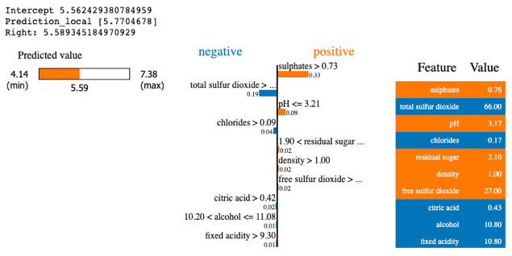
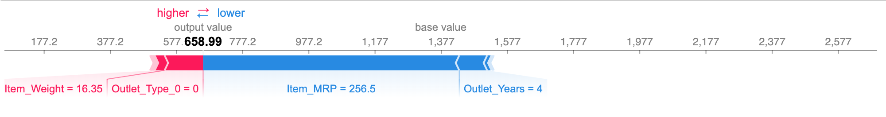
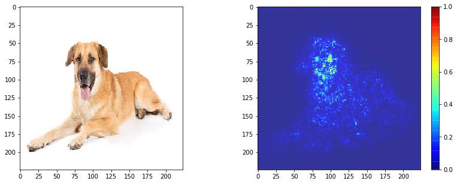

# How can we provide a simple post-hoc explanation for black-box model performance to ensure reliability?
Contributor: Joy Lin, Senior AI Technical Consultant

---

## Introduction

Interpretability and explainability have been the recent buzzwords in explainable AI as an attempt to decipher how models derive predictions. Interpretability indicates the model inputs and outputs can be determined. Conversely, explainability signifies knowledge of the model's inner representations and their contribution to the prediction. To avoid confusion, the term "explanation" is used literally here.

Explanations come in useful:
- during model development for error analysis
- after model deployment to ensure reliable predictions
- during model monitoring to detect bias or performance changes, avoiding significant social or financial impact
- during model maintenance to guide re-training

Before going further, let us visit two broad model types:
- **glass-box models**: inherently interpretable, highly translucent, less powerful, model-specific. E.g. linear regression model.

- **black-box models**: requires post-hoc interpretability, opaque, more powerful, model-agnostic. E.g. permutation feature importance.

While there exists many approaches to post-hoc interpretability, this article broadly introduces how to explain and interpret black-box models.

## Approaches

Consider if you want to:

A. provide insight between data inputs and outputs of model; or

B. explain representations of data inside a network.

### A. Model Agnostic Methods

When providing insight between data inputs and outputs of model, there is no access to model internals like weights or structural information. There are:

- **local model-agnostic methods**, which explain individual predictions. 

    Examples: 

    1. Local interpretable model-agnostic explanations (LIME): replaces the complex model with a locally interpretable surrogate model.
    
    *[[Source]](https://medium.com/dataman-in-ai/explain-your-model-with-lime-5a1a5867b423)*

    2. Shapley values: an attribution method that fairly assigns the prediction to individual features.
    
    *[[Source]](https://www.analyticsvidhya.com/blog/2019/11/shapley-value-machine-learning-interpretability-game-theory/)*

- **global model-agnostic methods**, which describe how features affect the prediction *on average*. This is useful to understand the general mechanisms in the data or model debugging.
    
    Examples: 

    1. Permutation feature importance: measures the importance of a feature as an increase in loss when the feature is permuted.
    
    *[[Source]](https://docs.oracle.com/en-us/iaas/tools/ads-sdk/latest/user_guide/mlx/permutation_importance.html#:~:text=Feature%20permutation%20importance%20measures%20the,to%20measure%20the%20prediction%20error.)*

    2. SHAP (SHapley Additive exPlanations): provides global interpretation methods by combinations of Shapley values across the data.
    
    *[[Source]](https://www.analyticsvidhya.com/blog/2019/11/shapley-value-machine-learning-interpretability-game-theory/)*

### B. Neural Network Interpretations
A neural network can have multiple nodes and layers where input data undergo complex mathematical operations to output predictions. However increasing network density makes it nearly impossible to represent these complexities in a human-readable way. Instead, we use visual representations of data inside a network to understand the predictions.
    
Examples:

1. Learned features

    A model can learn - with increasing complexity across the network layers - the various edges, textures, patterns, parts, and eventually objects in images. Assessing these network layers helps you understand the features learned (or missed).

    
    *[[Source]](https://distill.pub/2017/feature-visualization/)*

    Similarly, models can learn features from text or tabular data.

2. Pixel attribution using saliency maps

    Saliency maps provide another visualisation using ranked coloured pixels to indicate their contribution to the model prediction.
    
    *Input image (left) and corresponding saliency map (right). [[Source]](https://usmanr149.github.io/urmlblog/cnn/2020/05/01/Salincy-Maps.html)*

## References
- [Interpretable Machine Learning](https://christophm.github.io/interpretable-ml-book/)
- [Glass-box models (model-specific)](https://christophm.github.io/interpretable-ml-book/simple.html)
- [Black-box models (model-agnostic)](https://christophm.github.io/interpretable-ml-book/agnostic.html)