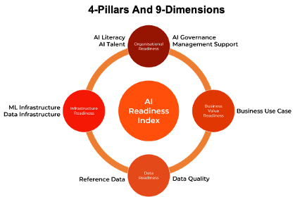
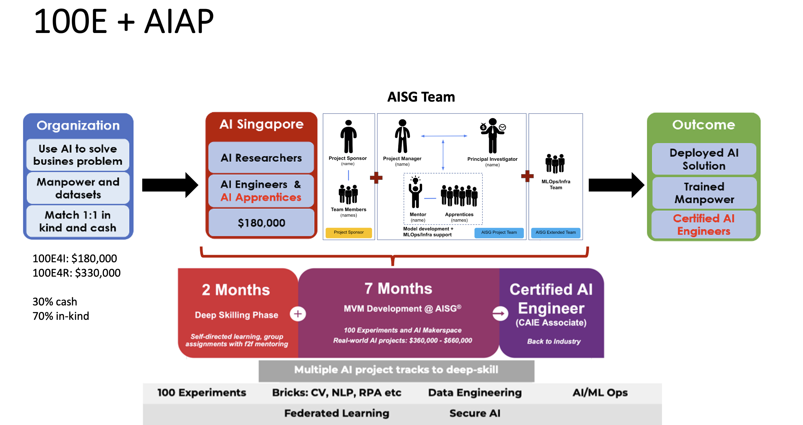
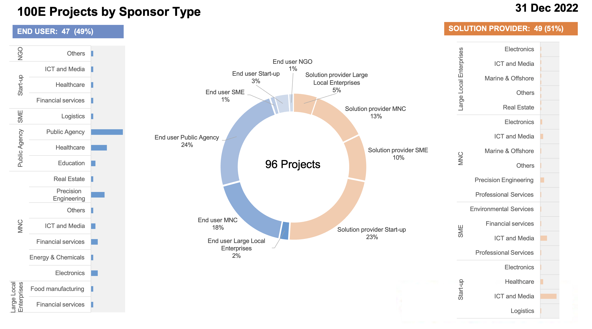

```{image} ./assets/images/logos/aisg-ai-practitioner-handbook-banner.png
:alt: AISG AI Practitioner Handbook Banner
:class: bg-primary mb-1
:align: center
```
# Welcome to AI Singapore's AI Practitioner Handbook

## Introduction

This handbook is an accumulation of AI Singapore’s Innovation and Platforms Engineering team's experience in delivering more than 40 AI Minimum Viable products (MVP) under the [100E](https://www.aisingapore.org/innovation/100e) programme over the last 5 years. 

We envisioned this handbook as a useful guide for new AI Engineers joining AI Singapore and to quickly come up to speed on how we execute AI projects. However, the information contained here would also appeal to new any AI Engineers and Managers deploying their first AI project into production.

Delivering production AI models goes beyond building AI models in Jupyter notebooks. It includes preliminary data identification, cleaning and curation, followed by building, training and testing the models and finally deploying the model. Throughout the process, AI and ML Ops play a fundamental role to enable the whole end-to-end process. 

There are many excellent books and resources on various AI algorithms, and we will not replicate them here. Instead, we will focus on the best practices and knowledge required to deliver an AI project from end to end.


## Identifying AI Ready Projects
AI projects executed by AI Singapore in the 100E programme are real-world problem statements from the industry and go through a rigorous review process before it gets approved and onboarded before any engineering work is done.

Leveraging the [AI Readiness Index (AIRI)](https://www.aisingapore.org/innovation/airi) developed by AI Singapore, we are able to quickly identify organizations that are AI Unaware, AI Aware, AI Ready or AI Competent. 

In the 100E programme, team's work focuses on AI Ready companies only[^1]. 





## Delivering AI Ready Projects

Projects approved under the 100E programme are delivered in 7 months following an Agile methodology, typically over 10-15 sprints.



The project team will consist of AI Singapore’s AI Researchers, Engineers, and AI Apprentices[^2] (from the AI Apprenticeship Programme) working on the project full-time for the duration of the project. They are supported by Project Managers and the AI and ML Ops teams to deliver the project on time, and with the right infrastructure and architecture powered by established CI/CD pipelines.

Our AI Engineers come from diverse academic disciplines and industry experience. In fact, many of our AI Engineers are hired from AI Apprentice cohorts. This handbook will provide new AI Engineers with a quick guide on our best practices to help them quickly become productive.

## Conclusion

Since 2017, we have engaged more than 600 companies, approved more than 100 projects and completed more than 50 of these AI projects under the 100E programme, and trained more than 200 AI Apprentices.



The Handbook is a live project and will continue to evolve and be updated as we do more projects and learn more.

Let us get started on your first AI project!

--

Laurence Liew, Director (AI Innovation)

---

[^1]: AI Singapore and other Singapore agencies have other programmes which assist companies that are AI Unaware and AI Aware.  
[^2]: Who are the AI Apprentices? See [How Did AI Singapore Build a “200” Strong All-Singaporean AI Engineering Team With the Blue Ocean Strategy?](https://aisingapore.org/2021/04/how-did-ai-singapore-build-a-200-strong-ai-engineering-team-with-the-blue-ocean-strategy/)